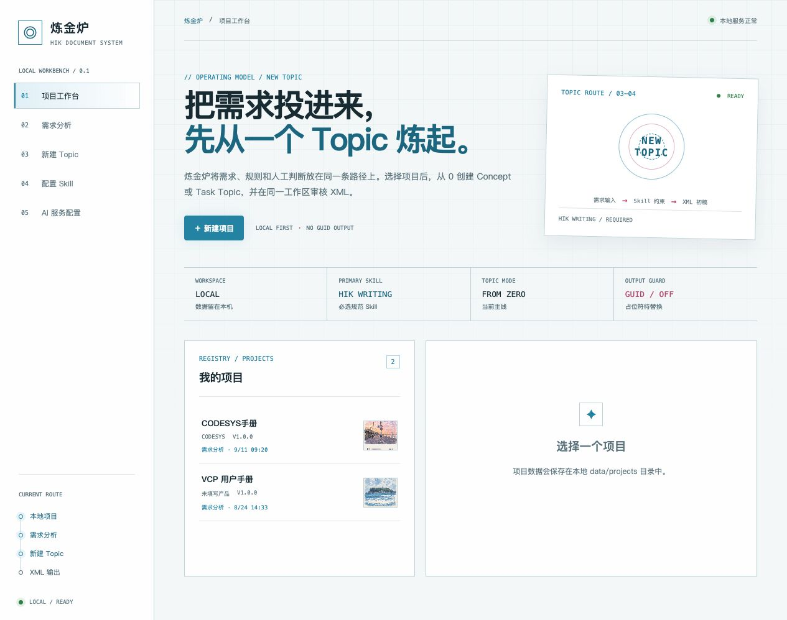
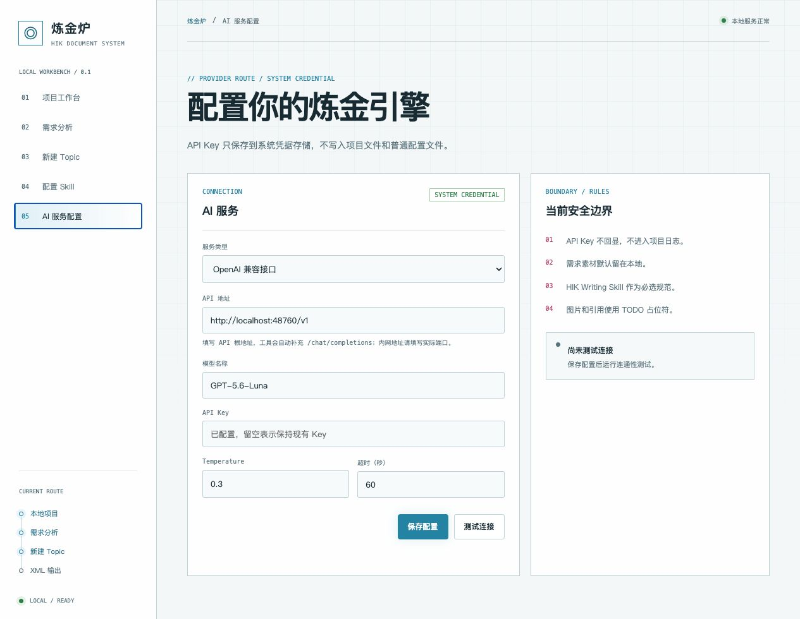
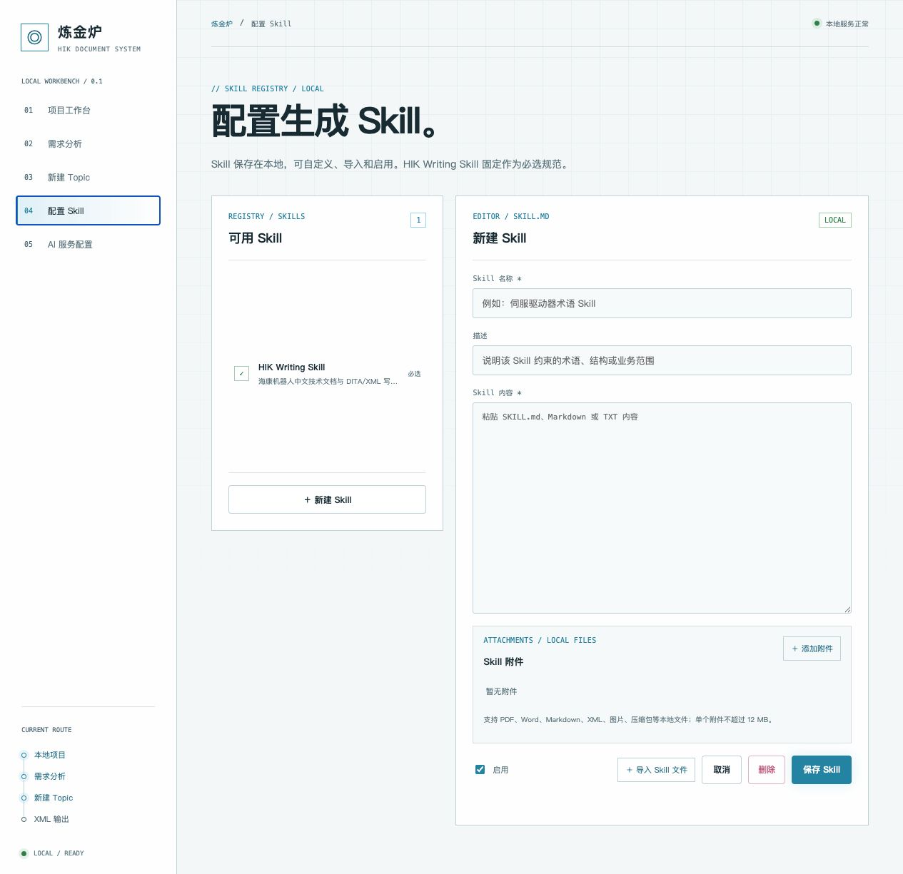
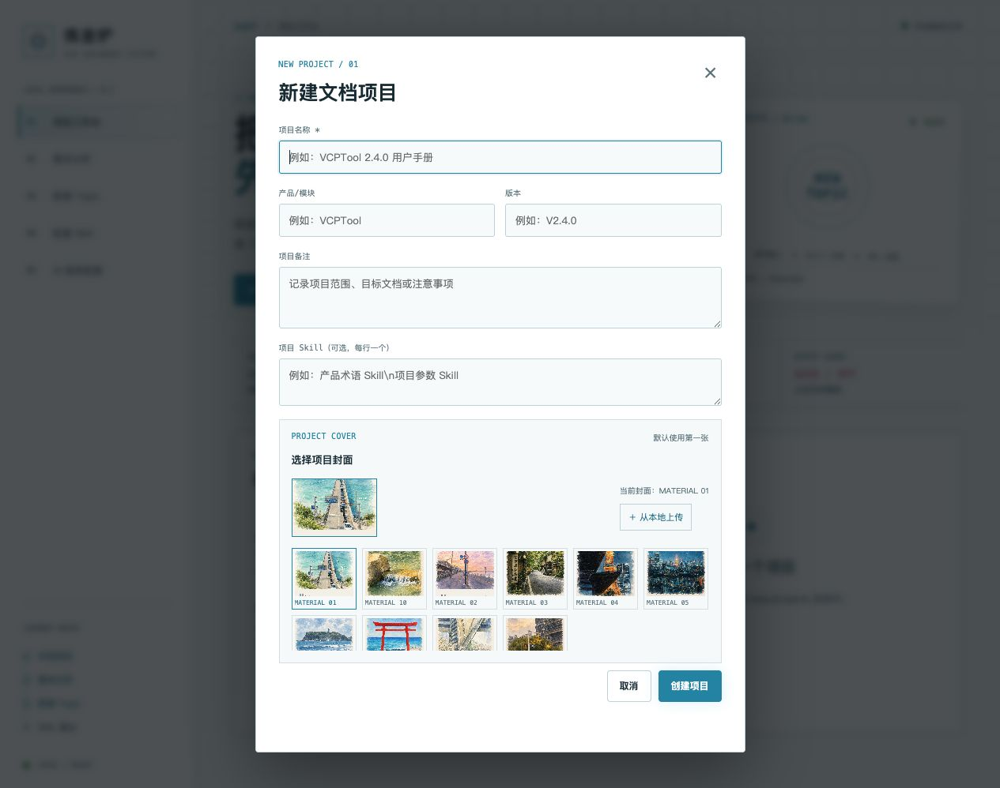
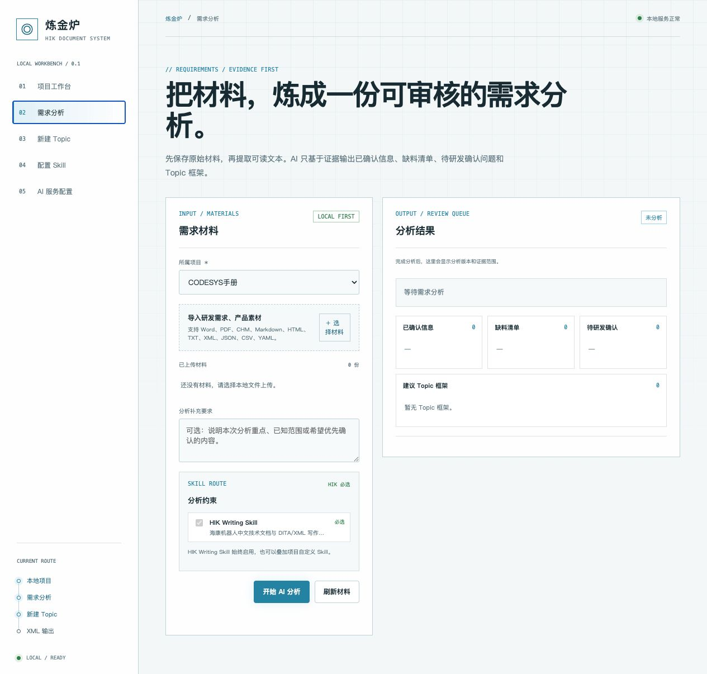
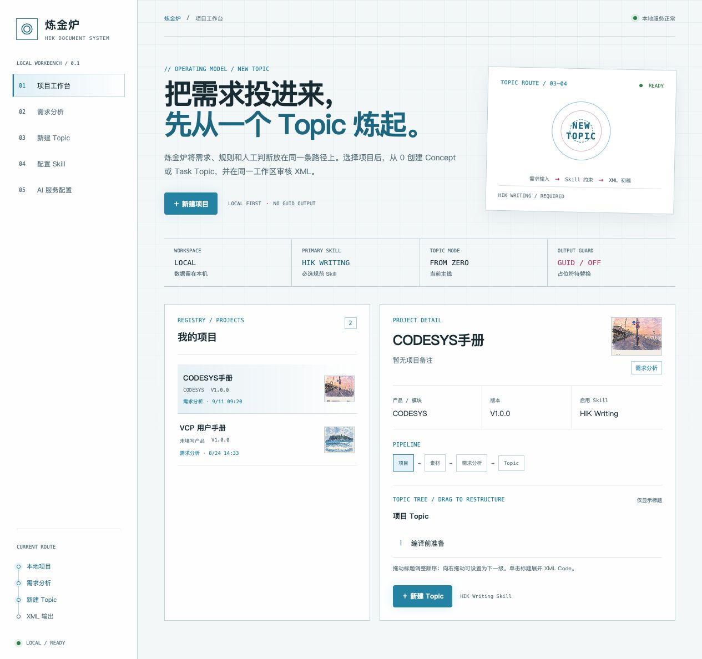
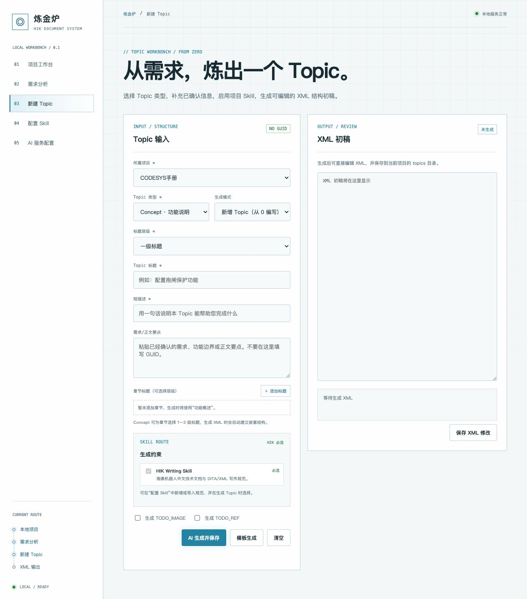
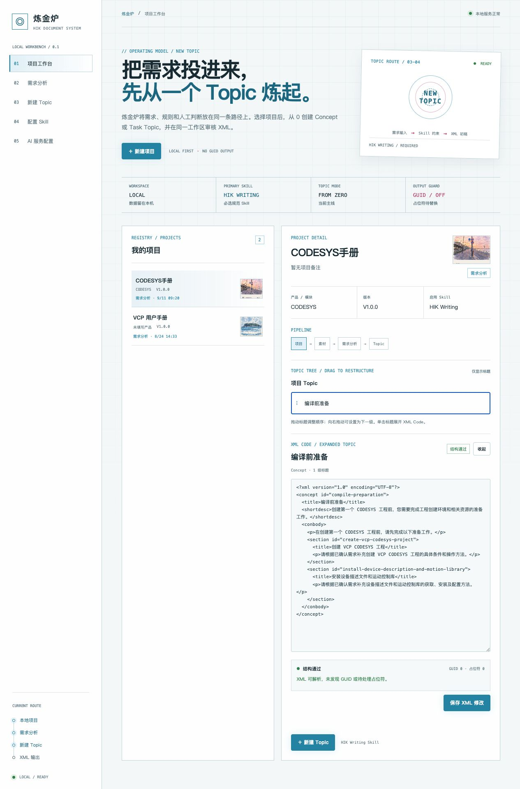

# 炼金炉：AI 驱动的需求分析与 XML 开发工具

> 版本：阶段 1 本地工作台 0.1（持续迭代版）  
> 适用对象：文档工程师、产品经理、研发和测试人员  
> 运行方式：macOS / Windows 本地运行，浏览器访问 `http://127.0.0.1:8765`

## 1. 工具简介

炼金炉面向 HIK 文档开发场景，将“需求材料整理—需求分析—Topic 结构设计—XML 初稿生成—人工审核”集中在一个本地工作台中完成。

工具的核心原则是：

- 原始材料、项目数据和 XML 代码优先保存在本地；
- HIK Writing Skill 始终作为必选规范；
- AI 负责提取信息、发现缺料、生成初稿；
- 文档工程师负责业务准确性、内容完整性和最终发布质量；
- 不生成 GUID，图片和引用使用 `TODO_IMAGE`、`TODO_REF` 占位符，后续由人工替换。

当前版本已覆盖三条主要工作路径：

- **全新开发**：从需求材料开始生成新的文档框架和 Topic；
- **版本更新**：导入上版本框架、Topic 或素材，基于变更内容继续开发；
- **Topic 优化**：选择已有 Topic，仅针对语言、结构和术语进行优化。

项目、框架、素材、Skill、XML 和版本记录均保存在本地。项目可以作为参考语料库被其他项目引用，引用内容会随源项目定稿内容更新。

## 2. 应用案例：生成 CODESYS 用户手册的“编译前准备” Topic

### 2.1 使用背景

以 CODESYS 用户手册为例，文档工程师需要根据产品需求、研发说明和已有资料，编写“编译前准备”章节。该章节需要说明：

1. 创建 VCP CODESYS 工程前需要完成哪些准备；
2. 如何准备设备描述文件和运动控制库；
3. 哪些内容已经确认，哪些内容仍需要研发补充；
4. 最终如何形成符合团队规范的 Concept XML。

传统方式需要工程师在多个文档、聊天记录和 XML 示例之间反复整理。使用炼金炉后，可以先将材料集中导入，再让 AI 输出可审核的分析结果和 Topic 初稿。

### 2.2 案例输入

| 项目项 | 示例内容 |
| --- | --- |
| 项目名称 | CODESYS手册 |
| 产品/模块 | CODESYS |
| 版本 | V1.0.0 |
| Topic 类型 | Concept · 功能说明 |
| Topic 标题 | 编译前准备 |
| 标题层级 | 一级标题 |
| 章节方向 | 创建 VCP CODESYS 工程；安装设备描述文件和运动控制库 |
| 必选规范 | HIK Writing Skill |
| 输出要求 | XML 初稿、不生成 GUID、保留必要占位符 |

### 2.3 案例输出

炼金炉可以生成一个可编辑的 Concept XML 结构，例如：

```xml
<?xml version="1.0" encoding="UTF-8"?>
<concept id="compile-preparation">
  <title>编译前准备</title>
  <shortdesc>创建第一个 CODESYS 工程前，您需要完成工程创建环境和相关资源的准备工作。</shortdesc>
  <conbody>
    <p>在创建第一个 CODESYS 工程前，请先完成以下准备工作。</p>
    <section id="create-vcp-codesys-project">
      <title>创建 VCP CODESYS 工程</title>
      <p>请根据已确认需求补充创建 VCP CODESYS 工程的具体条件和操作方法。</p>
    </section>
    <section id="install-device-description-and-motion-library">
      <title>安装设备描述文件和运动控制库</title>
      <p>请根据已确认需求补充设备描述文件和运动控制库的获取、安装及配置方法。</p>
    </section>
  </conbody>
</concept>
```

这个结果的价值不在于替代人工审核，而在于先完成 Topic 骨架、标题层级和 XML 结构搭建，并明确指出仍需研发补充的细节。工程师可以直接在 XML 编辑区继续润色和校验。

## 3. 从启动到输出的完整操作步骤

### 步骤 1：启动炼金炉

macOS 版：双击 `启动炼金炉.command`；Windows 版：解压便携包后双击 `start_lianjinlu.bat`。浏览器打开：

`http://127.0.0.1:8765`

首页可以看到本地工作台状态、已有项目和“新建项目”入口。数据默认保存在本机 `data/` 目录。



### 步骤 2：配置 AI 服务

首次使用时，进入左侧“AI 服务配置”，填写：

1. 服务类型：选择 OpenAI 兼容接口、Anthropic 或本地模型；
2. API 地址：填写服务根地址，例如 `http://127.0.0.1:8000/v1`；
3. 模型名称：填写实际可调用的模型名；
4. API Key：输入密钥后保存；
5. 点击“测试连接”，确认返回成功。

API Key 不会显示在页面上，也不会写入 `data/settings.json`。macOS 使用 Keychain，Windows 使用 Credential Manager。



> 如果显示连接失败，优先检查 API 地址是否包含正确端口和 `/v1` 路径，并确认模型服务已启动。浏览器页面本身是本地运行的，但 AI 请求仍需要能够访问配置的模型服务地址。

### 步骤 3：配置 Skill

进入“配置 Skill”，可以查看、创建、导入和启用自定义 Skill。

建议将 Skill 分为三类：

- 写作规范：术语、语气、标题和段落要求；
- 产品规范：产品名称、功能边界、参数和界面术语；
- 项目约束：本次版本的范围、已确认事项和禁止描述的内容。

HIK Writing Skill 会始终默认选中且不可取消。自定义 Skill 可以粘贴 `SKILL.md`、Markdown 或 TXT 内容，也可以添加 PDF、Word、XML、图片和压缩包等附件。



### 步骤 4：选择模式、新建项目并设置封面

首页提供三种项目模式，三种模式都通过“新建项目”创建独立项目：

| 模式 | 适用场景 | 主要输入 |
| --- | --- | --- |
| 全新开发 | 从 0 搭建新手册或新模块 | 需求材料、产品素材、Skill |
| 版本更新 | 基于上版本框架和 XML 做新增或变更 | 上版本项目/框架、变更材料、更新要求 |
| Topic 优化 | 只优化某个 Topic 的语言和结构 | 原 XML、研发素材、优化 Skill、优化要求 |

点击“新建项目”，填写项目名称、产品/模块、版本、模式和项目备注。项目封面默认使用素材墙第一张图片，也可以选择其他素材或从本地上传。

项目列表中的封面会以 `cover` 模式填充整个卡片，图片靠右显示，向左逐渐透明，以保证项目名称和状态信息清晰可读。

建议项目名称使用“产品 + 文档类型 + 版本”的形式，例如：

`CODESYS V1.0.0 用户手册`

项目 Skill 可以在创建时填写，也可以后续在项目或 Topic 生成时选择。



### 步骤 5：导入需求材料并开展需求分析

进入“需求分析”，选择所属项目，点击“选择材料”导入研发需求、产品说明或其他原始资料。

当前常用格式支持情况如下：

| 格式 | 当前处理方式 |
| --- | --- |
| Word `.docx` | 可直接提取文本 |
| Markdown、HTML、TXT | 可直接提取文本 |
| XML、JSON、CSV、YAML | 可读取文本内容 |
| PDF | 保留原文件；安装 `pdftotext` 后可提取文本 |
| CHM | 保留原文件；安装 `extract_chmLib` 后可提取文本 |
| 旧版 Word `.doc` | 依赖系统可用的文本转换工具 |

导入后可以在“本次生成提示词”中说明本次分析重点，例如“重点检查新增功能的边界、异常处理和研发待确认项”。分析时会默认选中 HIK Writing Skill，也可以追加或编辑其他 Skill。

点击“生成框架”，结果将按以下几类展示：

- 已确认信息；
- 缺料清单；
- 待研发确认问题；
- 建议 Topic 框架。



### 步骤 6：编辑 Markdown 框架并查看脑图

需求分析完成后，页面主体分为两部分：

- 左侧是 Markdown 编辑器，直接修改标题、层级和章节概述；
- 右侧是脑图/鱼骨图预览，随 Markdown 内容实时更新。

脑图工具栏支持：

- 主题切换：示例四色、浅色和谐；
- 布局切换：脑图、鱼骨图；
- 展开/收起全部章节概述；
- 缩放、适应、重置和全屏；
- “演示”模式逐个显示节点，当前节点自动聚焦；
- 单击节点进入 Topic XML 编辑，双击节点标题直接修改 Markdown。

参考“思维导图配色设计指南”的视觉规范，当前框架使用奶油色画布、四色分支、方形节点、偏移式硬阴影和分层连接线。

### 步骤 7：审核分析结果并确定 Topic 结构

先不要直接接受 AI 结论，建议按以下顺序审核：

1. 确认 AI 使用的材料范围是否完整；
2. 查看缺料清单，补充缺失的版本、参数、前置条件或异常处理；
3. 将待研发确认问题复制到评审清单；
4. 检查建议 Topic 是否与手册目录和用户任务一致；
5. 研发确认后，再进入 Topic 生成。

返回“项目工作台”后，可以看到项目流水线和 Topic 大纲。大纲默认只显示标题，不展示正文，便于快速检查目录结构。不同一级分支使用不同颜色，子级使用同色系浅色，并通过连接线表达层级关系。

拖动标题可以调整顺序，向右拖动可以设置为下一级；单击标题可以展开该 Topic 的 XML Code。



### 步骤 8：从框架节点生成 Topic XML

确定框架后，有两种入口：

1. 在框架脑图中单击 Topic 节点；
2. 在项目主页的大纲中单击 Topic 标题。

进入 Topic 编辑窗口后，按以下顺序检查或填写：

1. 选择所属项目；
2. 选择 Topic 类型：Concept、Task 或附录类 Concept；
3. 选择标题层级：一级、二级或三级标题；
4. 填写 Topic 标题；
5. 填写短描述；
6. 在“需求/正文要点”中粘贴已确认的需求和功能边界；
7. Concept 类型可以添加章节标题，并分别设置标题级别；
8. 检查 HIK Writing Skill 和需要叠加的自定义 Skill；
9. 按需勾选 `TODO_IMAGE` 和 `TODO_REF` 占位符。

框架节点会自动带入章节标题、章节概述、标题层级和当前项目材料。生成前可以重新选择 Skill、编辑提示词，并根据需要填写研发素材或优化要求。

三种模式的 Topic 处理方式如下：

- 全新开发：从章节概述和需求材料生成新的 XML；
- 版本更新：基于上版本 XML，生成新增或更新后的 XML；
- Topic 优化：基于原 XML，只调整语言、结构和术语，不改变业务事实。

如果对结果不满意，可以在提示词中补充调整方向，再次生成。框架页还支持批量生成多个 Topic。

点击“模板生成”可以先生成本地结构模板；点击“AI 生成并保存”则会调用已配置的模型生成内容。



### 步骤 9：审核、修改、复制和导出 XML

生成后，XML 编辑区会显示代码。工程师可以手动修改 XML、一键复制 XML，或选择以下格式下载：XML、Word、Text、Markdown。

工程师应重点检查：

- Topic 类型和标题层级是否正确；
- 标题、短描述和正文是否符合业务语义；
- 是否出现模型臆造的参数、按钮、路径或前置条件；
- 图片位置是否需要替换为真实图片；
- `TODO_IMAGE`、`TODO_REF` 是否已登记并准备后续替换；
- XML 是否解析通过；
- 是否存在 GUID 或 `GUID=xxx`；
- 是否需要补充 `id`、章节标题和交叉引用。

在项目工作台中单击 Topic 标题即可展开 XML Code。校验报告会显示结构状态、GUID 数量和占位符数量。确认修改后点击“保存 XML 修改”。



## 4. 推荐的团队协作流程

建议把炼金炉作为“初稿和证据整理工作台”，而不是无人审核的自动发布工具：

```text
导入原始材料
      ↓
AI 提取已确认信息、缺料和待确认问题
      ↓
文档工程师审核需求范围
      ↓
确定 Topic 框架和标题层级
      ↓
选择 HIK Writing Skill + 项目 Skill
      ↓
生成 XML 初稿
      ↓
人工校验业务准确性、图片、引用和术语
      ↓
保存 XML，替换 TODO 占位符后进入正式发布流程
```

推荐的审核分工：

- 产品：确认功能范围、版本范围和用户目标；
- 研发：确认技术实现、限制条件、参数和异常处理；
- 文档工程师：确认结构、表达、DITA/XML 规范和最终可读性；
- 测试：补充操作前置条件、验证步骤和预期结果。

## 5. 常见问题与排查

### 5.1 无法连接模型

检查服务是否启动、API 地址是否正确、端口是否开放、模型名是否正确。对于 OpenAI 兼容服务，通常需要填写类似：

```text
http://127.0.0.1:8000/v1
```

工具会自动补充 `/chat/completions`。不要只填写没有服务监听的主机地址。

### 5.2 PDF 或 CHM 显示“未提取文本”

这不代表文件丢失。工具会保留原始文件，但当前环境没有对应解析工具时，AI 无法直接读取其中的文本。可安装 `pdftotext` 或 `extract_chmLib` 后重新刷新材料。

### 5.3 XML 中出现 TODO 占位符

这是预期行为。`TODO_IMAGE` 和 `TODO_REF` 是非 GUID 占位符，后续应由工程师替换为真实图片路径或引用目标。校验报告会提醒仍存在待处理占位符。

### 5.4 当前版本不生成 Reference Topic

Reference 类型 Topic 当前暂不分析和生成。若原始材料中存在 Reference 内容，建议先作为普通材料保存，待后续版本支持后再处理。

### 5.5 当前版本的能力边界

当前版本已支持全新开发、版本更新和 Topic 优化三种项目模式，支持基于框架节点生成单个 Topic、批量生成 Topic、手动编辑 XML、复制 XML 以及 XML/Word/Text/Markdown 下载。

以下能力仍建议由人工确认或作为后续增强方向：

- PDF、CHM 的文本提取依赖系统工具；
- Word 下载当前为可由 Word 打开的 HTML 文档格式，不等同于复杂排版的原生 `.docx`；
- 需求分析结果仍需要产品和研发确认，AI 不应直接替代评审；
- Reference Topic 暂不作为独立 Topic 类型分析和生成；
- 正式发布前仍需在目标 DITA/XML 工具链中进行最终校验。

## 6. 截图索引

文档配套截图位于 `docs/炼金炉使用说明/截图/` 目录：

| 截图 | 内容 |
| --- | --- |
| [01-项目工作台.jpg](截图/01-项目工作台.jpg) | 首页、本地工作台和项目入口 |
| [02-新建项目与封面.jpg](截图/02-新建项目与封面.jpg) | 新建项目、模式和封面选择 |
| [03-项目详情与Topic层级.jpg](截图/03-项目详情与Topic层级.jpg) | 项目详情、Topic 层级和参考语料库 |
| [04-新建Topic与Skill.jpg](截图/04-新建Topic与Skill.jpg) | 新建 Topic 和 Skill 约束 |
| [05-Topic层级与XML审核.jpg](截图/05-Topic层级与XML审核.jpg) | Topic 层级、XML 编辑和校验 |
| [06-Skill配置与附件.jpg](截图/06-Skill配置与附件.jpg) | Skill 配置、导入和附件 |
| [07-AI服务配置.jpg](截图/07-AI服务配置.jpg) | API 地址、模型和 API Key 配置 |
| [08-需求分析与材料导入.jpg](截图/08-需求分析与材料导入.jpg) | 需求分析、材料导入和分析结果 |

截图为操作示意，界面中的颜色、脑图节点样式和封面展示效果会随当前版本主题配置更新。

## 7. 一句话总结

炼金炉把文档工程师从重复的材料整理和 XML 起稿工作中解放出来，让工程师把时间集中在更有价值的工作上：确认需求、发现风险、校验业务逻辑，以及保证最终文档质量。
